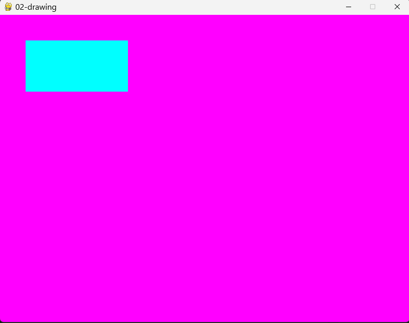

# pygame-samples
Bunch of small pygame samples showcasing functionality, and basic game architecture


setup   


## Design goals

### Aimed at starting students

### Self contained samples

If you have looked at the samples, you will have noticed there is a lot of code duplication (the same code copy pasted across). You probably also learned that this is a __bad thing__. Both are true. We chose to duplicate code as we did for one specific reason: we wanted all of our samples to live on their own. This means that you can read the file of a sample, and you will see everything you need to implement it in your own project.

The alternative would have been to create a separate file with common code, and to only have the specific code to a sample in that file. This would have been the `correct` way in a professional project, but everything would be spread around. 

## Structure

All the documentation of the samples are in this document (for easy browsing and searching), or comments in the code. The samples are organized in folders. Eg in the folder `basic`, you'll find all the samples to get a cube moving on a screen. In the folder `utility`, you'll find various little techniques (such as an FPS counter). In the folder `games`, you'll find very basic implementations of various kinds of games (platformer, infinite runner....)


## Basic samples

These samples demonstrate basic functionality every game probably wants to have. 

### 00-window

This sample demonstrates how to open a window. Two things are remarkable:

1. The program is written to have an infinite loop. This will mostly be important later (when we add things in the loop), but for now, we have the loop to make sure the windows stays open. Without it, the program will open the window, run to the end, and close it while terminating
2. We can't close the window or the application. Try it! Run the script, and try clicking the X. There are several ways to close it instead (all of them brutal, and they work on any app) //TODO add linux and mac, images
    1. If you launched it from the terminal, focus that terminal (it should say `Hello from the pygame community. https://www.pygame.org/contribute.html`), and type CTRL+c
    2. Open task manager by pressing CTRL+SHIFT+ESCAPE. Click the tab `Processes`. Select `python.exe` and press DELETE. //TODO add images
    //TODO add procexp and the kill button

### 01-events

This sample demonstrates capturing events from the window. Specifically, we're looking for the QUIT event, which is created when the user presses the X button on the window

First, we declare a variable `running`, which we set to `True`. Our game loop will keep looping as long as `running` is set to `True`:

    running = True
    while running:

Second, we ask for all events, and loop through them:

    for event in pygame.event.get():

Right now, we're only interested in one event, the QUIT event which is created when a user presses X on the window

        if event.type == pygame.QUIT:

Within this block, we set `running` to `False`. This will cause our loop to finish, finishing and exiting the game.

            running = False

And that's it! It looks like a small step, but this is a good building block. We're going to use the same event system later to receive input from the keyboard and mouse. 

### 02-drawing

This sample demonstrates how to get the most basic drawing to work in your game. First, we need a little bit of background to understand what is going on.

Games (not just pygame's, but every game) have two images, which you can imagine as canvasses that a painter paints on. One is shown on the screen to the user, the other one is the one we paint on. Once we're done painting, we remove the shown canvas from the screen, and show the new one. The one that was shown, is the one we're going to paint the next image on.

Now, let's look at the code. We have a canvas in front of us. It has an image on it that we've already shown on the screen, but we don't want that image, we want to make a new one. First, we fill it with a solid color.

``` python
    # Fill the screen with magenta
    screen.fill((255, 0, 255))
```

It's confusing, we have called that image `screen`. This is not the screen, this is the image that was shown on the screen. Best not to think about it too much. What you do need to think about, is the `(255, 0, 255)` part. [`fill`](https://www.pygame.org/docs/ref/surface.html?highlight=fill#pygame.Surface.fill) takes one argument. That argument should be a tuple of 3 integers between 0 and 255. These are RGB values, which are a common way to define colors. You can find RGB values of common color using [this website](https://www.rapidtables.com/web/color/RGB_Color.html)

``` python
    screen.fill((255, 0, 255))
```

Next, we want to draw something on the screen, at a certain position. We'll draw a cyan rectangle in the top left corner.

``` python
    # Draw a cyan rectangle
    pygame.draw.rect(screen, (0, 255, 255), (50, 50, 200, 100))  
```

That's a lot of argument! Let's break it down. We're using [pygame.draw.rect](https://www.pygame.org/docs/ref/draw.html#pygame.draw.rect). It takes 3 arguments:

1. The image to draw to. For us, this is always `screen`, unless you're doing some very advanced stuff
2. The color of the rectangle. This is defined as a RGB tuple, just like the fill. In this case, since we want cyan, we use `(0, 255, 255)`
3. The position and dimensions (width and height) of the rectangle. This is measured from the top left of the window. We defined it as `(50, 50, 200, 100)`. This means, our rectangle will start 50 pixels to the right of the left border of the window, 50 pixels lower than the top of whe window, and it will be 200 pixels wide, and 100 pixels tall.

Now, if you would only use these commands, you won't see any magenta or cyan yet. That's because we're making our image, but we're never actually moving it to the screen to be visible to the player. For that, we need one more command. 

``` python
    # Show our drawing on the screen
    pygame.display.flip()
```

This tell pygame to put our image on the screen, and the other one will become the variable `screen`, ready to be drawn to next.



So that's it! Your game should have three steps 

1. Clear the image
2. Draw what you need to draw
3. Flip

You only need to flip when you're done. You always draw everything again. You might think this is inefficient (why not only draw what changed?). It's a very long explanation, but every game, from the smallest indie game to the biggest AAA game does it this way. Because it works, and avoids bugs.

For the nerdy (which should be all of you), some extra notes:

* In proper terminology, we call the image we draw to as the `backbuffer`
* The speed at which we draw images and `flip` them, is called `frames per second` or `FPS`. If we can draw 50 images in one second, we have 50 FPS
* I've confused you with the terms canvas, image, (back)buffer, screen. I'm sorry. All these terms are used for the same thing. At least you know now
* Why choose magenta to clear the screen? So it's really easy to see if you have any 'holes' in your drawing. Games want to fill the entire screen with nice art, and we want to know if part of the screen is not drawn to. We use magenta, because it's very obvious to the eye, and it's very uncommon to have magenta legitimately in an image. That's because [magenta doesn't exist](https://www.bbc.com/reel/playlist/a-fairer-world?vpid=p0f00wph)

### 03-input-keyboard

This sample demonstrated how to get the state of the keyboard. It uses the `SPACEBAR` key to move the rectangle right. It's based on the previous sample.

First, we make the position on the x-axis (left-right) of the rectangle a variable:

``` python
# X position of the rectangle, initially completely to the left
rect_x = 0
```

We also modify the call to `pygame.draw.rect` to use the variable 